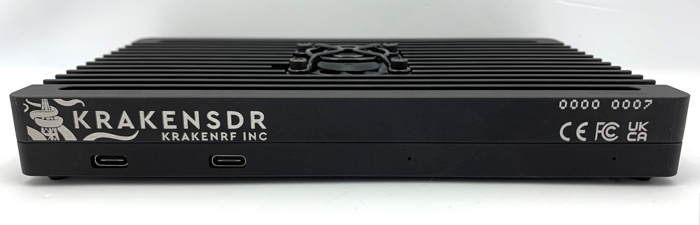

# KrakenSDR Resources:

<div align="center">
    <p>
        KrakenSDR Front Panel:
    </p>
<br>

<small>
    <a href="https://www.crowdsupply.com/img/79fd/fb341482-f9bf-4afa-8129-e19dc54079fd/krakensdr-blackenclosure1_jpg_md-xl.jpg">
        Image Source
    </a>
</small>
</div>

<div align="center">
    <p>
        KrakenSDR 5 Channel Internal Breakdown:
    </p>
<br>

<small>
    <a href="https://github.com/krakenrf/krakensdr_docs/wiki">
        Image Source
    </a>
</small>
</div>

---

- [KrakenRF Website](https://www.krakenrf.com/)
- [KrakenRF CrowdSupply Page](https://www.crowdsupply.com/krakenrf/krakensdr)
- [KrakenRF GitHub Page](https://github.com/krakenrf)
    - [KrakenSDR Direction of Arrival](https://github.com/krakenrf/krakensdr_doa) Repo.
    - [KrakenSDR Passive Radar](https://github.com/mfkiwl/krakensdr_pr) Repo.
    - [GNU Radio Source Block](https://github.com/krakenrf/gr-krakensdr) for the KrakenSDR.
    - [Kraken RPi 4 Pre-Configured Image](https://github.com/krakenrf/krakensdr_doa/releases) For Direction Finding.
    - [Ubuntu VirtualBox Pre-Configured VMs](https://mega.nz/folder/MaFCyAyJ#TCl1uCNVAHkCbnSsrG56bQ)&nbsp;&nbsp;**See Notes on VM Below**
        - Use with VirtualBox 7.0 or later.
        - For Linux Hosts: `sudo adduser $USER vboxusers`
        - Ubuntu Username: `krakenrf`, Password: `krakensdr`
- [KrakenSDR Documentation Wiki](https://github.com/krakenrf/krakensdr_docs/wiki)
    - [Quick Start Guide](https://github.com/krakenrf/krakensdr_docs/wiki/02.-Direction-Finding-Quickstart-Guide) for Direction Finding
    - [Antenna Array Setup](https://github.com/krakenrf/krakensdr_docs/wiki/04.-Antenna-Array-Setup#using-the-excel-calculator) for Direction Finding.
    - [Troubleshooting Tips](https://github.com/krakenrf/krakensdr_docs/wiki/07.-KrakenSDR-Troubleshooting) for the pre-built Raspberry Pi 4 Image.
- [Kraken YT Page](https://www.youtube.com/@thekraken2086)
    - [Kraken Vehicle Direction Finding Video](https://www.youtube.com/watch?v=OY16y1Rl86g)
    - Compare to Rohde & Schwarz Live [Interference Hunting Demonstration](https://www.youtube.com/watch?v=IIH9OiLGN2g)
- A 3D Printable [Antenna Array Template](https://www.thingiverse.com/thing:5787042) on Thingiverse
- [Passive Radar Applications](http://gbppr.net/kraken/index.html)
- [KrakenSDR RDF Android App](https://play.google.com/store/apps/details?id=com.krakensdr.krakendoa)
- [Arrow Antennas 5 Element Dipole Array](https://www.arrowantennas.com/arrowii/krsdr.html): A Tower mount 5 channel antenna for direction finding with the KrakenSDR.
- [KiwiSDR Resources](http://kiwisdr.com/)

## Notes on KrakenSDR Mobile Power Requirements:
In order to set up a mobile DoA setup using a Rasperry Pi 4 or 5, The following power requirements need to be taken into account:
- The [Raspberry Pi 4](https://www.raspberrypi.com/products/type-c-power-supply/) requires at least a 5V 3.0A (15W) power supply. Note that the CanaKit Pi 4 power supply we used was rated at 18W.
- The [Raspberry Pi 5](https://www.raspberrypi.com/products/27w-power-supply/) requires a 27W power supply (5.0V 5.4A)
- The [KrakenSDR docs](https://github.com/krakenrf/krakensdr_docs/wiki) state that it draws a nominal value of 11W, and requires at least a 5V 2.4A (12W) power supply.
    - Note that this nominal value does not take into account any current supplied by any of the 4.5V bias-tees for each SMA input. Any additional current for this purpose must be added to the 12W baseline if the bias-tee is used.
    - As a result, I have found a reasonable 2 &times; 30W USB-C cigarette lighter power supply here that seems to have ample power: [USB C Car Charger, 60W Cigarette Lighter](https://www.amazon.com/dp/B09MT5QPQM/?th=1)

## Notes on the Preconfigured VirtualBox VM:

1. After importing the OVA appliance to VBox 7.0+:
    - Allocate 4 vCPUs & 8192 MB of RAM to the Kraken Ubuntu VM.
    - Increase the display video memory to 128 MB.
    - Make sure to test run and UPDATE the image (this may take awhile).
        - In Ubuntu, if this does not happen automatically, then click `Activities` in the top right corner and search for `Software Updater`.
    - With the KrakenSDR plugged in and powered on:
        - The RTL-SDR USB Device Filter should already be added in the VBox hypervisor.
        - If not, add it here: `Settings -> USB -> USB Device Filters`

2. Next, we need to fix the 16 MB `usbfs_memory_mb` that will prevent using all 5 RTL-SDRs in the KrakenSDR.
    - Temporary Fix (Does Not Survive Reboot):
        - open a terminal and login as root: `sudo su` and enter the password.
        - now enter `echo 0 > /sys/module/usbcore/parameters/usbfs_memory_mb`
        - now verify the change by logging out of the root terminal (CTRL+d) and entering 
        `cat /sys/module/usbcore/parameters/usbfs_memory_mb` and we should now see the value `0`.
        - This allows for testing of 5 channel simulaneous operation. Open 5 separate terminals:
            - In the first terminal, enter `kraken_test -d0` to open channel `0`.
            - In the second terminal, enter `kraken_test -d1` to open channel `1`.
            - In the third terminal, enter `kraken_test -d2` to open channel `2`.
            - In the fourth terminal, enter `kraken_test -d3` to open channel `3`.
            - In the fifth terminal, enter `kraken_test -d4` to open channel `4`.
            - Each terminal should hang and update itself periodically, indicating the channel is opened, until a CTRL+c is entered. If any of the tests fail to run then the value of the `usbfs_memory_mb` has likely been reset to `16`, which is an insufficient value to retreive all data from the 5 RTL-SDRs simultaneously via USB-C from the Kraken.
    - Permanent Fix (Ubuntu): change the grub config when booting:
        - Edit /etc/default/grub: `sudo nano /etc/default/grub`
            - Append `usbcore.usbfs_memory_mb=0` to the `GRUB_CMDLINE_LINUX` variables between the double quotes.
            - CTRL+x to exit and save.
        - From the command line, enter: `sudo grub-mkconfig -o /boot/grub/grub.cfg` to write the new grub configuration. We need to reboot for this to take effect.
        - Next, enter: `reboot`
        - After reboot, in a new terminal window enter: `cat /sys/module/usbcore/parameters/usbfs_memory_mb` and we should see a value of `0` if the USBFS fix worked.
        - Now we must verify that all 5 KrakenSDR channels can be opened simultaneously.

3. Next, we need to change the Hemdall DAQ Data Interface settings:
    - Enter: `nano ~/krakensdr_doa/heimdall_daq_fw/Firmware/daq_chain_config.ini`
    - At the bottom of the file, under the `[data_interface]` section:
        - replace old interface with ethernet: `out_data_iface_type = eth`
        - CTRL+x to exit and save.

4. Download the two missing Heimdall bash scripts from the [`gr-krakensdr`](https://github.com/krakenrf/gr-krakensdr) repo:
    - [`heimdall_only_start.sh`](https://github.com/krakenrf/gr-krakensdr/blob/main/heimdall_only_start.sh)
    - [`heimdall_only_stop.sh`](https://github.com/krakenrf/gr-krakensdr/blob/main/heimdall_only_stop.sh)
    - Place both scripts into the root krakensdr folder of the VM: `~/krakensdr_doa/`
    - Open a terminal, navigate to `~/krakensdr_doa/` and make both scripts executable:
        - `sudo chmod +x heimdall_only_start.sh heimdal_only_stop.sh`
    - In order to run GNU Radio, the `heimdall_only_start.sh`
    - Without running this script, when executing a flow graph the following error is encountered:
        - `Ethernet Connection Failed, Error: <class 'ConnectionRefusedError'>`

5. Revert back to `Xorg` from `wayland` to avoid the warnings when running flow graphs in GNU Radio:
    - Edit the following file: `sudo nano /etc/gdm3/custom.conf`
        - Uncomment the line `WaylandEnable=False`
        - CTRL+x to save and exit.
    - Edit the following file: `sudo nano /etc/environment`
        - Append the following on a new line: `QT_QPA_PLATFORM=xcb`
        - CTRL+x to save and exit.
        - Now reboot: `sudo reboot now`
        - check the following: `echo $XDG_SESSION_TYPE` and it should **NOT** return `wayland`
            - In my case, it returned `x11`
    - In some instances, this warning was preventing the output GUI window from opening.

6. When running a GNURadio flow graph, if you receive a warning message popup that states:

``` 
The xterm executable is missing. You can change this setting in your gnuradio.conf, 
in section [grc] 'xterm_executable' 
```
- Then it can be corrected by editing `/grc.conf`:
    - `sudo nano /etc/gnuradio/conf.d/grc.conf`
    - find the line that begins with the variable `xterm_executable=...` and change it to:
        - `xterm_executable=/usr/bin/gnome-terminal` (Assuming you are using gnome-terminal like I am)
        - CTRL+x to save and exit.

7. Also see [This GitHub Issue #6923](https://github.com/gnuradio/gnuradio/issues/6923)if using GNURadio in the VM and experience the following:
When running a GNURadio Flow Graph which requires realtime scheduling, if the following error message in the
console is encountered:

```python
def main(top_block_cls=transceiver_CSS_loopback, options=None):   
    if gr.enable_realtime_scheduling() != gr.RT_OK:   
        gr.logger("realtime").warning("Error: failed to enable real-time scheduling.")
AttributeError: 'gnuradio.gr.gr_python.logger' object has no attribute 'warning'
```

The fix is to allow user's tasks gain the ability to ask for real-time scheduling. Run the following in a terminal:

```bash
echo "$(whoami)  -  rtprio  99" | sudo tee /etc/security/limits.d/99-rtprio.conf
```

Then perform a reboot and the problem should be solved. Thanks to [This GitHub Issue #6923](https://github.com/gnuradio/gnuradio/issues/6923) for the solution.