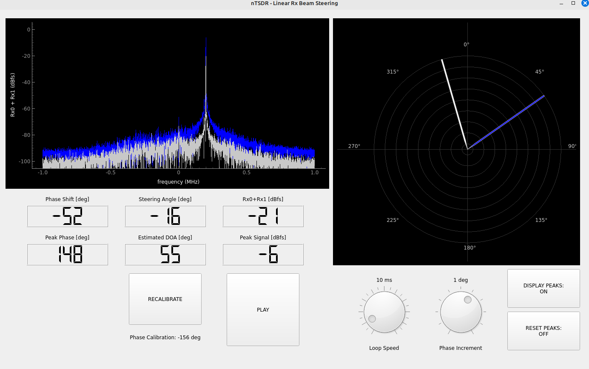
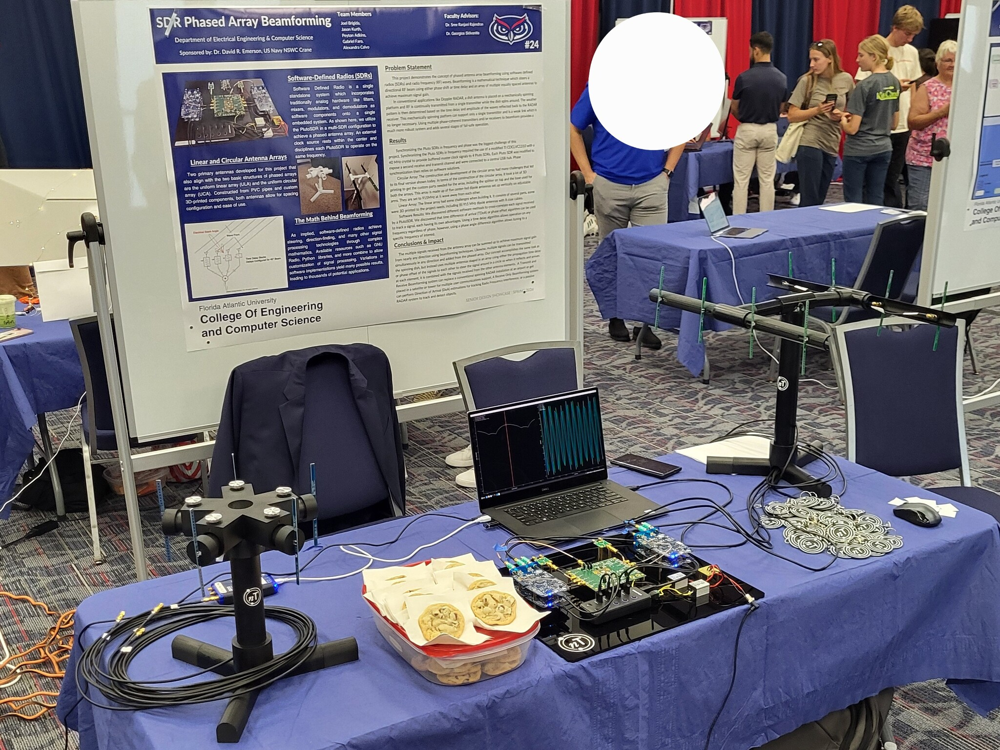

<div align="center">

# SDR Phased Array Beamforming
### Software-Defined Radio Research & Implementation

[](https://github.com/ADolbyB/sdr-beamforming/stargazers)
[](https://github.com/ADolbyB/sdr-beamforming/network/members)
[](https://github.com/ADolbyB/sdr-beamforming)
[](https://github.com/ADolbyB/sdr-beamforming/commits/main)

**Senior Engineering Capstone Project - Grade: A**

[](https://www.python.org/)
[](https://www.gnuradio.org/)
[](https://www.riverbankcomputing.com/software/pyqt/)

**Developed by:** [](https://github.com/ADolbyB) & [](https://github.com/peyton127)

</div>

---

## 📡 Project Overview

This repository documents a comprehensive research and implementation project for **Software-Defined Radio (SDR) phased array beamforming**. Originally focused on evaluating the PlutoSDR platform, the project evolved into a multi-platform SDR research initiative exploring various beamforming architectures, phase-coherent systems, and direction-finding applications.

**Research Focus Areas:**
- Multi-channel phase-coherent SDR systems
- Digital beamforming algorithms and implementation
- MIMO (Multiple Input Multiple Output) wireless communications
- Direction of Arrival (DoA) estimation
- Passive radar systems
- RF hardware synchronization techniques

---

## 🎯 Project Objectives

| Objective | Status | Description |
|-----------|--------|-------------|
| **Hardware Evaluation** | ✅ Complete | Compare multiple SDR platforms for beamforming applications |
| **Phase Coherence** | ✅ Complete | Achieve phase-synchronized multi-channel operation |
| **GUI Development** | ✅ Complete | Create intuitive PyQt5 control interface |
| **Beamsteering Demo** | ✅ Complete | Demonstrate real-time beam direction control |
| **Documentation** | ✅ Complete | Comprehensive research compilation and references |

**Final Grade: A** - Successfully demonstrated phase-coherent beamforming with custom GUI control

---

## 🖥️ Project GUI

Interactive PyQt5 graphical interface for real-time beamsteering control and visualization.

[](https://github.com/RayzrReptile/PyQT_GUI)

**GUI Features:**
- Real-time phase control for individual antenna elements
- Visual beam pattern display
- Interactive steering angle adjustment
- Signal strength monitoring
- Hardware configuration interface

**Repository:** Visit the dedicated [PyQT_GUI Project Repo](https://github.com/RayzrReptile/PyQT_GUI) for implementation details.

*Developed by [@RayzrReptile](https://github.com/RayzrReptile)*

---

## 🛠️ Hardware Platforms Evaluated

### SDR Platforms

| Platform | Channels | Frequency Range | Phase Coherent | Cost | Notes |
|----------|----------|-----------------|----------------|------|-------|
| **PlutoSDR** | 1 TX / 1 RX | 325 MHz - 3.8 GHz | ⚠️ Requires external clock | ~$150 | Initial platform, requires sync |
| **KrakenSDR** | 5 RX | 24 MHz - 1.766 GHz | ✅ Native | ~$300 | Excellent for DoA |
| **AD-FMCOMMS5-EBZ** | 4 TX / 4 RX | 70 MHz - 6 GHz | ✅ Native | ~$1,445 | 2x AD9361, ideal for prototyping |
| **USRP B210** | 2 TX / 2 RX | 70 MHz - 6 GHz | ✅ Native | ~$2,165 | Professional solution |
| **ADI CNO566 Phaser** | 2 TX / 2 RX | 8 GHz - 16 GHz | ✅ Native | ~$2,500 | High-frequency applications |
| **USRP N310** | 4 TX / 4 RX | 10 MHz - 6 GHz | ✅ Native | ~$17,765 | Enterprise-grade |

### External Clock Sources

**Critical for Multi-PlutoSDR Phase Synchronization:**

| Clock Source | Type | Frequency Range | Accuracy | Cost |
|--------------|------|-----------------|----------|------|
| **TI CDCLVC1310-EVM** | Square Wave | 1 MHz - 200 MHz | Standard | ~$30 |
| **Leo Bodnar Mini GPS** | GPSDO | 400 Hz - 810 MHz | GPS-disciplined | ~$150 |
| **Leo Bodnar LBE-1420** | GPSDO | 1 Hz - 1.1 GHz | GPS-disciplined | ~$200 |

**Note:** Successfully tested TI CDCLVC1310-EVM with 40 MHz crystal replacement for PlutoSDR synchronization.

---

## 📚 Repository Structure

```
sdr-beamforming/
├── PhaseCoherence/         # Phase synchronization experiments
│   ├── assets/             # GUI screenshots and diagrams
│   └── qtgui/              # Phase alignment final script for phase coherence.
├── Research/               # Academic papers and documentation
│   ├── AnalogDevices/      # Research papers for beamforming
│   ├── Gabriel/            # Gabriel's Research: Learning resources
│   ├── Jason/              # Jason's Research: Learning resources
│   ├── Joel/               # Joel's Research: Learning resources
│   ├── Peyton/             # Peyton's Research: Learning resources
│   └── Testing/            # Build and Test Instructions
├── Toolbox/                # Extra tools, scripts and screenshots for testing and debug
│   ├── GNURadio/           # GNU Radio flowgraph files for testing and debug with PlutoSDR
│   │   └── README.md       # Bugfix and Tutorials link for GNU Radio
│   ├── KrakenSDR/          # KrakenSDR-specific scripts for testing and debug
│   │   └── README.md       # Notes on KrakenSDR implementation
│   └── PlutoSDR/           # PlutoSDR scripts for testing and debug
│   │   └── README.md       # Modification and sources of PlutoSDRs for 2 TX & 2 RX channels
└── README.md               # This document
```

---

## 🔬 Technical Implementation

### Phase Coherence Methodology

**Challenge:** Achieving phase-locked operation across multiple independent SDR units.

**Solution:**
1. **External Clock Distribution**
   - 40 MHz reference clock from TI CDCLVC1310-EVM
   - SMA to u.FL cables for PlutoSDR modification
   - SDR devices and SMA coaxial cables for clock and RF

2. **Software Synchronization**
   - GNU Radio timing alignment blocks
   - Custom Python phase calibration scripts
   - Real-time phase offset correction

3. **Beamforming Algorithm**
   - Digital phase shifting in baseband
   - Weighted sum beamforming
   - Adaptive null steering

### System Architecture

```
[Transmitter] → [Antenna Array] → [SDR RX Channels] → [GNU Radio] → [PyQt5 GUI]
                                         ↓
                                  [Phase Alignment]
                                         ↓
                                  [Beamforming DSP]
                                         ↓
                                  [Direction Output]
```

---

## 📖 Key Research Resources

### Phase Synchronization

- [Multi-Channel Phase-Stable Signal Generation](https://www.keysight.com/blogs/en/tech/rfmw/2019/04/10/how-to-generate-multi-channel-phase-stable-and-phase-coherent-signals) - Keysight Technologies
- [Multi-Channel Timing and Phase Alignment](https://www.keysight.com/blogs/en/tech/rfmw/2019/04/18/how-to-perform-multi-channel-timing-and-phase-alignment) - Keysight Technologies
- [Phase Alignment Among Multiple Transmitters](https://www.freepatentsonline.com/y2016/0308598.html) - Patent documentation

### Analog Devices Resources

- [ADI CNO566 Phased Array Development Platform](https://www.analog.com/en/resources/reference-designs/circuits-from-the-lab/cn0566.html)
- [ADI Phased Array Solutions](https://www.analog.com/en/applications/markets/aerospace-and-defense-pavilion-home/phased-array-solution.html)
- [ADAR-1000 Evaluation Board](https://www.analog.com/en/resources/evaluation-hardware-and-software/evaluation-boards-kits/EVAL-ADAR1000.html)

### Essential GitHub Repositories

| Repository | Author | Description |
|------------|--------|-------------|
| [Pluto_Beamformer](https://github.com/jonkraft/Pluto_Beamformer) | Jon Kraft | PlutoSDR beamforming implementation |
| [PlutoSDR_Labs](https://github.com/jonkraft/PlutoSDR_Labs) | Jon Kraft | Educational SDR experiments |
| [PhasedArray](https://github.com/jonkraft/PhasedArray) | Jon Kraft | ADAR-1000 beamforming |
| [krakensdr_doa](https://github.com/krakenrf/krakensdr_doa) | KrakenRF | Direction finding algorithms |
| [krakensdr_pr](https://github.com/mfkiwl/krakensdr_pr) | mfkiwl | Passive radar implementation |
| [rtl-sdr](https://github.com/osmocom/rtl-sdr) | osmocom | RTL-SDR driver library |
| [multi-rtl](https://github.com/ptrkrysik/multi-rtl) | ptrkrysik | RTL-SDR synchronization |
| [gr-iio](https://github.com/analogdevicesinc/gr-iio) | Analog Devices | GNU Radio IIO blocks |
| [gnuradio](https://github.com/gnuradio/gnuradio) | GNU Radio | Core SDR framework |

---

## 📐 RF Theory & Design

### Fundamental Concepts

**MIMO Technology:**
- [Understanding MIMO Basics](https://www.rfmw.com/data/swa-mimo-basics.pdf) - SWA
- [Technical Overview of MIMO](https://www.keysight.com/us/en/lib/resources/training-materials/technical-overview-of-mimo-1179977.html) - Keysight
- [SDR meets MIMO Design](https://www.eetimes.com/tutorial-sdr-meets-mimo-or-all-you-need-to-know-about-designing-mimo-with-a-software-defined-radio/) - EE Times
- [Basics of MIMO Radio Systems](https://www.ezurio.com/resources/white-papers/basics-of-mimo-radio-systems) - Ezurio

**Signal Processing:**
- [I/Q Data for Dummies](http://whiteboard.ping.se/SDR/IQ) - Visual explanation
- [Processing I/Q Signals in SDR](https://www.allaboutcircuits.com/technical-articles/how-to-process-iq-signals-software-defined-rf-receiver-dsp-digital-signal/) - All About Circuits
- [The Fourier Transform](https://www.thefouriertransform.com/) - Interactive website
- [Quadrature Signals](https://www.mathworks.com/content/dam/mathworks/mathworks-dot-com/moler/quad.pdf) - MATLAB

### Educational Materials

**Video Resources:**
- [What Is Beamforming?](https://www.youtube.com/watch?v=VOGjHxlisyo)
- [What Are Phased Arrays?](https://www.youtube.com/watch?v=9WxWun0E-PM)
- [Digital Beamforming Advantages](https://www.youtube.com/watch?v=Hb6BhqOgmAI)
- [SDR Systems and Analysis](https://www.youtube.com/playlist?list=PLBfTSoOqoRnOTBTLahXBlxaDUNWdZ3FdS) - 26-lecture series

**Textbooks & Guides:**
- [SDR for Engineers](https://www.analog.com/en/education/education-library/software-defined-radio-for-engineers.html) - Analog Devices
- [Field Expedient SDR Vol. 1-3](https://www.factorialabs.com/fieldxp/) - Practical implementations
- [Phased Array Antenna Handbook](http://twanclik.free.fr/electricity/electronic/pdfdone11/Phased.Array.Antenna.Handbook.Artech.House.Publishers.Second.Edition.eBook-kB.pdf)
- [Antenna Theory Analysis and Design](https://cds.cern.ch/record/1416310/files/047166782X_TOC.pdf)

**LibreTexts Engineering Series:**
1. [Fundamentals of Microwave and RF Design](https://eng.libretexts.org/Bookshelves/Electrical_Engineering/Electronics/Book%3A_Fundamentals_of_Microwave_and_RF_Design_(Steer))
2. [Radio Systems](https://eng.libretexts.org/Bookshelves/Electrical_Engineering/Electronics/Microwave_and_RF_Design_I_-_Radio_Systems_(Steer))
3. [Transmission Lines](https://eng.libretexts.org/Bookshelves/Electrical_Engineering/Electronics/Microwave_and_RF_Design_II_-_Transmission_Lines_(Steer))
4. [Networks](https://eng.libretexts.org/Bookshelves/Electrical_Engineering/Electronics/Microwave_and_RF_Design_III_-_Networks_(Steer))
5. [Modules](https://eng.libretexts.org/Bookshelves/Electrical_Engineering/Electronics/Microwave_and_RF_Design_IV%3A_Modules_(Steer))
6. [Amplifiers and Oscillators](https://eng.libretexts.org/Bookshelves/Electrical_Engineering/Electronics/Microwave_and_RF_Design_V%3A_Amplifiers_and_Oscillators_(Steer))

### Antenna Design

**Resources:**
- [Antenna Theory](https://www.antenna-theory.com/) - Comprehensive website
- [Smith Chart Tutorial](https://www.antenna-theory.com/tutorial/smith/chart.php) - Essential tool
- [MIMO Antennas Explained](https://www.waveform.com/a/b/guides/mimo-antenna-guide) - Waveform

**Modeling Software (Windows):**
- [EZNEC Antenna Software](https://eznec.com/) - Professional antenna modeling
- [4nec2](https://www.qsl.net/4nec2/) - Free NEC-based modeler

---

## 🔧 Test Equipment & Tools

### Recommended Lab Equipment

**Spectrum Analysis:**
- **TinySA Ultra** (~$150) - 0.1 MHz to 5.3 GHz
  - [Official Wiki](https://tinysa.org/wiki/pmwiki.php?n=Main.HomePage)
  - Portable, battery-powered, excellent for field work

**Network Analysis:**
- **NanoVNA** (~$120) - Vector Network Analyzer
  - [Official Site](https://nanovna.com/)
  - [Beginner's Guide PDF](http://www.nemarc.org/Absolute_Beginner_Guide_NanoVNA.pdf)
  - [Calibration Routine](https://nanovna.com/?page_id=2)
- **NanoRFE VNA6000** (~$789) - 5 kHz to 6 GHz
  - Professional-grade handheld VNA

**GPS-Disciplined Oscillators:**
- [NIST GPSDO Guide](https://www.nist.gov/publications/use-gps-disciplined-oscillators-primary-frequency-standards-calibration-and-metrology)
- [QSL.net Beginner's GPSDO Guide](https://www.qsl.net/zl1bpu/PROJ/NGPSDO/GPSDO%20Beginner.PDF)

### Software Tools

**Linux & Windows:**
- [QtTinySA](https://github.com/g4ixt/QtTinySA) - Desktop GUI for TinySA

**Linux:**
- [GQRX](https://gqrx.dk/) - Software-defined radio receiver

**Windows:**
- [SDR#](https://airspy.com/download/) - Popular SDR software
- [SDR Console](https://www.sdr-radio.com/) - Advanced features
- [HDSDR](http://www.hdsdr.de/) - Classic SDR software
- [DSD+](https://www.dsdplus.com/) - Digital signal decoder
- [Unitrunker](http://www.unitrunker.com/) - Trunked radio decoder

---

## 🚀 Getting Started

### Prerequisites

**Hardware:**
- SDR platform (PlutoSDR, KrakenSDR, or USRP)
- External clock source (for multi-unit synchronization)
- Antenna array (dipoles, patches, or helical)
- RF cables and adapters

**Software:**
- Python 3.8+
- GNU Radio 3.8+
- PyQt5
- NumPy, SciPy, Matplotlib

### Installation

```bash
# Clone the repository
git clone https://github.com/ADolbyB/sdr-beamforming.git
cd sdr-beamforming

# Install GNU Radio (Ubuntu/Debian)
sudo apt-get install gnuradio

# For PlutoSDR support
sudo apt-get install libiio-utils
```

### Quick Start

1. **Configure Hardware**
   - Connect external clock source (must use multiple SDRs)
   - Attach antenna array with proper spacing (λ/2 recommended)
   - Connect SDR units to host computer with a USB hub.

2. **Run Phase Calibration GUI**
   ```bash
   cd PhaseCoherence/qtgui
   python RxBeamSteer_GUI.py
   ```

3. **Start Beamforming**
   - Load GNU Radio flowgraph
   - Adjust beam steering angle via GUI
   - Monitor real-time output

---

## 🎓 Academic Context

**Course:** Senior Engineering Design Project  
**Institution:** *Florida Atlantic University*  
**Semester:** *Fall 2023 - Spring 2024*  
**Final Grade:** **A**

**Team Members:**
- [Joel Brigida](https://github.com/ADolbyB) - Hardware integration, RF testing, documentation
- [Peyton Adkins](https://github.com/peyton127) - Software development, GUI design, signal processing
- [Jason Kurth](https://www.jasonkurthphoto.com/) - Hardware design and prototyping
- [Alexandra Calvo](https://www.linkedin.com/in/alexandra-calvo-9973008a/) - Hardware design, antenna design, documentation
- [Gabriel Faro](https://www.linkedin.com/in/gabriel-faro/) - Hardware design, 3D printing, documentation

**Project Scope:**
This capstone project explored the practical implementation of phased array beamforming using software-defined radios. The five-member team evaluated multiple SDR platforms, developed phase synchronization techniques, designed custom antenna arrays, created mechanical mounting solutions through 3D printing, and delivered a functional demonstration system with real-time beam steering capabilities.

---

## 🖼️ Project Gallery

### Live Demonstration Setup



**Senior Design Expo Demonstration** - Florida Atlantic University

Our team presented a fully functional phased array beamforming system at the FAU College of Engineering and Computer Science Senior Design Expo. The demonstration featured:

**Hardware on Display:**
- Multiple PlutoSDR units with external clock synchronization
- Custom 3D-printed antenna mounting systems
- Linear and circular antenna array configurations
- Live real-time beamforming visualization
- Professional poster presentation (Booth #24)

**Live Capabilities Demonstrated:**
- Real-time phase-coherent signal reception
- Interactive beam steering control via PyQt5 GUI
- Visual representation of antenna array geometry
- Direction-of-arrival estimation
- Multi-channel signal processing in real-time

**Antenna Array Designs:**
- Uniform Linear Array (ULA) for directional scanning
- Uniform Circular Array (UCA) for 360° coverage
- Custom dipole antenna elements (visible in demonstration)
- Precision-spaced dipole configurations

> 📸 *Photo shows complete demonstration setup including synchronized PlutoSDRs, antenna arrays, real-time GUI visualization, and professional project poster at the FAU Senior Design Expo.*

---

## 🌐 Real-World Applications

**Commercial Uses:**
- **Wireless Communications:** 5G MIMO antenna systems
- **Radar Systems:** Phased array weather radar, military applications
- **UAV Communications:** High-bandwidth video streaming from drones
  - [StreamCaster UAV Integration](https://www.unmannedsystemstechnology.com/2022/09/streamcaster-radios-integrated-into-evtol-commerical-uav/)
- **Tactical Communications:** [Silvus StreamCaster Radios](https://silvustechnologies.com/products/streamcaster-radios/)

**Research Applications:**
- Radio astronomy
- Passive radar
- Direction finding
- Electronic warfare (defensive)

---

## 📄 License

This project is licensed under the MIT License - see the [LICENSE](LICENSE) file for details.

**Academic Integrity Notice:** This repository represents completed coursework. If you're currently enrolled in a similar course, please use this as reference material only and adhere to your institution's academic honesty policies.

---

## 🤝 Contributing

While this is a completed academic project, we welcome:
- Bug reports and fixes
- Documentation improvements
- Additional hardware platform support
- Enhanced signal processing algorithms

Please open an issue or submit a pull request!

---

## 📞 Contact & Acknowledgments

**Project Maintainers:**
- [Joel Brigida](https://github.com/ADolbyB) - Hardware integration, RF testing, documentation
- [Peyton Adkins](https://github.com/peyton127) - Software development, GUI design, signal processing
- [Jason Kurth](https://www.jasonkurthphoto.com/) - Hardware design and prototyping
- [Alexandra Calvo](https://www.linkedin.com/in/alexandra-calvo-9973008a/) - Hardware design, antenna design, documentation
- [Gabriel Faro](https://www.linkedin.com/in/gabriel-faro/) - Hardware design, 3D printing, documentation

**Project Sponsorship:**
- **Dr. David R. Emerson** - US Navy NSWC Crane
- Florida Atlantic University - College of Engineering and Computer Science

**Faculty Support:**
- Dr. Sree Ranjani Rajendran - Faculty Advisor
- Dr. Georgios Sklivanitis - Faculty Advisor

**Special Thanks:**
- Jon Kraft - Extensive PlutoSDR beamforming resources
- Analog Devices - Hardware documentation and support
- GNU Radio Community - Open-source SDR framework
- KrakenRF Team - Direction finding algorithms
- US Navy NIWC - Project sponsorship and guidance

**Research Support:**
- FAU Department of Electrical Engineering & Computer Science
- Industry partners and open-source SDR community

---

## 📊 Project Stats

<div align="center">


</div>

---

<div align="center">

**Advancing RF Technology Through Open Research**

*Phased Array Beamforming - From Theory to Implementation*

[](https://github.com/ADolbyB)

</div>