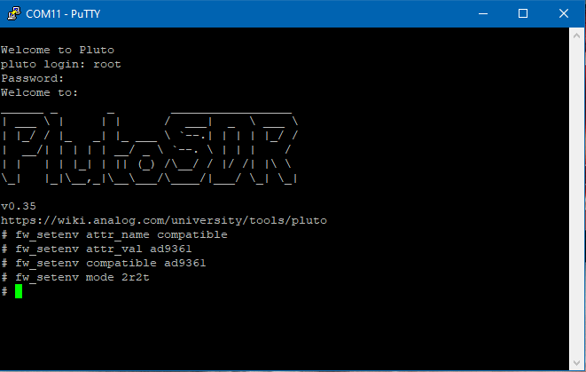
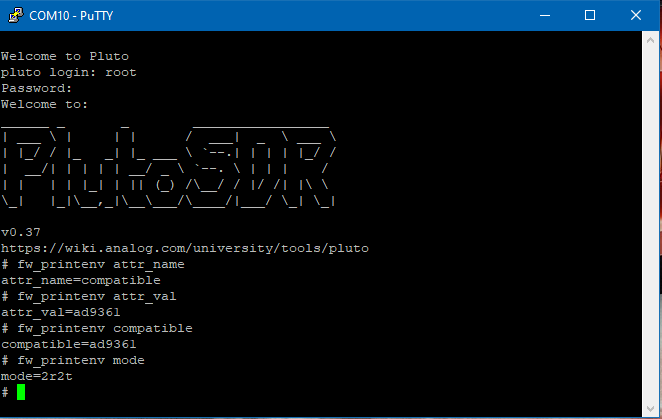

# Pluto SDR

This repo is a compilation of code and resources for the ADALM-PLUTO SDR module for project research of the beamforming concept. The code in the `testCode` folder has been compiled from other sources as working skeleton code for the AD936x Tranceiver for testing purposes.

 

<small>
    <a href="https://www.analog.com/en/design-center/evaluation-hardware-and-software/evaluation-boards-kits/adalm-pluto.html">
        Image Source
    </a>
</small>

## Screenshots:

Pluto Settings for TX and RX Modifications:

 

Verify Updated Firmware & Modified Settings. 
Note that `root` password = `analog`

 

## Sources:

Enable Dual Receive, Dual Transmit and Expand Tuning Range to 0.7 - 6.0GHz for Rev C and newer Pluto SDR:
 - Video: [Enable Dual TX & Dual RX](https://www.youtube.com/watch?v=ph0Kv4SgSuI)
 - Code: [Jon Kraft: Pluto SDR Labs](https://github.com/jonkraft/PlutoSDR_Labs/tree/master)
 - Settings Table: [Environmental Settings](https://wiki.analog.com/university/tools/pluto/devs/booting)
     - Use [PuTTY](https://www.chiark.greenend.org.uk/~sgtatham/putty/latest.html) for Windows or a Terminal in Linux for shell access.
     - In my case, I connected via the serial COM port with PuTTY in Windows 10.

### Free Installs:

Linux:
 - [GNU Radio: Wiki](https://wiki.gnuradio.org/index.php/InstallingGR)
 - [GQRX](https://github.com/gqrx-sdr/gqrx/releases)

Windows:
 - [AirSpy: SDR Sharp](https://airspy.com/download/)

Pluto SDR Tools and Overview:
 - [Overview and Introduction](https://wiki.analog.com/university/tools/pluto)
 - [ADALM-Pluto for End Users](https://wiki.analog.com/university/tools/pluto/users)

Pluto SDR Quick Start Drivers & IIO Scope:
 - [Quick Start Resources](https://wiki.analog.com/university/tools/pluto/users/quick_start)
 - [Lib-IIO drivers for IIO Scope](https://github.com/analogdevicesinc/libad9361-iio/releases/tag/v0.3)

Pluto SDR Firmware Updates:
 - [Pluto/M2k Firmware](https://wiki.analog.com/university/tools/pluto/users/firmware)

DIY Phased Array using Pluto SDR:
 - Video: [Build Your Own Phased Array Beamformer](https://www.youtube.com/watch?v=2QXKuEYR4Bw)
 - Video: [Monopulse Tracking with a Low Cost Pluto SDR](https://www.youtube.com/watch?v=XP8OWMDHfOQ)
 - Video: [Implementing Time Delay For a Low Cost Digital Beamformer](https://www.youtube.com/watch?v=gQjnSK0UHGQ)
     - Code: [Jon Kraft: Pluto Beamformer](https://github.com/jonkraft/Pluto_Beamformer)
 - Video: [Phased Array Beamforming: Understanding and Prototyping](https://www.youtube.com/watch?v=0hnWfTvETcU)
     - Code: [Jon Kraft: Phased Array Workshop](https://github.com/jonkraft/PhasedArray)
 - Video: [Jon Kraft: Rapid Phased Array Prototyping](https://www.youtube.com/watch?v=B_icccUpxV0)

PyADI-IIO: Python for ADI Industrial I/O Devices:
 - Web Docs: [AD936x Hardware](https://analogdevicesinc.github.io/pyadi-iio/devices/adi.ad936x.html)
 - Code: [Examples, Test, RF](https://github.com/analogdevicesinc/pyadi-iio/tree/master/examples) Folders.

Coding Docs:
 - [Pluto SDR in Python](https://pysdr.org/content/pluto.html)

ADI Kuiper Linux for Raspberry Pi (Debian 10 Buster):
 - [Information and Downloads](https://wiki.analog.com/resources/tools-software/linux-software/kuiper-linux)
 - [Pre-Configured Image](https://download.analog.com/phased-array-lab/raspi.7z)

Basic Raspberry Pi Install From Scratch:
 - [RPi 3B+ Bare Install](https://github.com/jonkraft/Pluto-Install-for-Raspberry-Pi)

## Other Resources:

Applications of Phased Arrays: 
 - [ADI Phased Arrays](https://www.analog.com/en/applications/markets/aerospace-and-defense-pavilion-home/phased-array-solution.html)

Videos:
 - [Advances in Phased Array Analog Beamforming Solutions](https://ez.analog.com/webinar/c/e/182)
 - [What Is Beamforming?](https://www.youtube.com/watch?v=VOGjHxlisyo)
 - [What Are Phased Arrays?](https://www.youtube.com/watch?v=9WxWun0E-PM)
 - [Why Is Digital Beamforming Useful?](https://www.youtube.com/watch?v=Hb6BhqOgmAI)
 - [Software Defined Radio Systems and Analysis Playlist](https://www.youtube.com/playlist?list=PLBfTSoOqoRnOTBTLahXBlxaDUNWdZ3FdS): 26 Lectures

SDR Online Lessons:
 - [Great Scott Gadgets](https://greatscottgadgets.com/sdr/) Tutorials

Articles: 
 - [DIY Radio: Jon Kraft](https://ez.analog.com/tags/DIYRadio)

Books: 
 - [SDR For Engineers](https://www.analog.com/en/education/education-library/software-defined-radio-for-engineers.html)
 - [Field Expedient SDR Volumes 1-3](https://www.factorialabs.com/fieldxp/)
 - [Phased Array Antenna Handbook](http://twanclik.free.fr/electricity/electronic/pdfdone11/Phased.Array.Antenna.Handbook.Artech.House.Publishers.Second.Edition.eBook-kB.pdf)
 - [Antenna Theory Analysis and Design](https://cds.cern.ch/record/1416310/files/047166782X_TOC.pdf)

Also see the informational documents posted in the [assets-docs](./assets-docs/) folder of this repo.

## Status:

