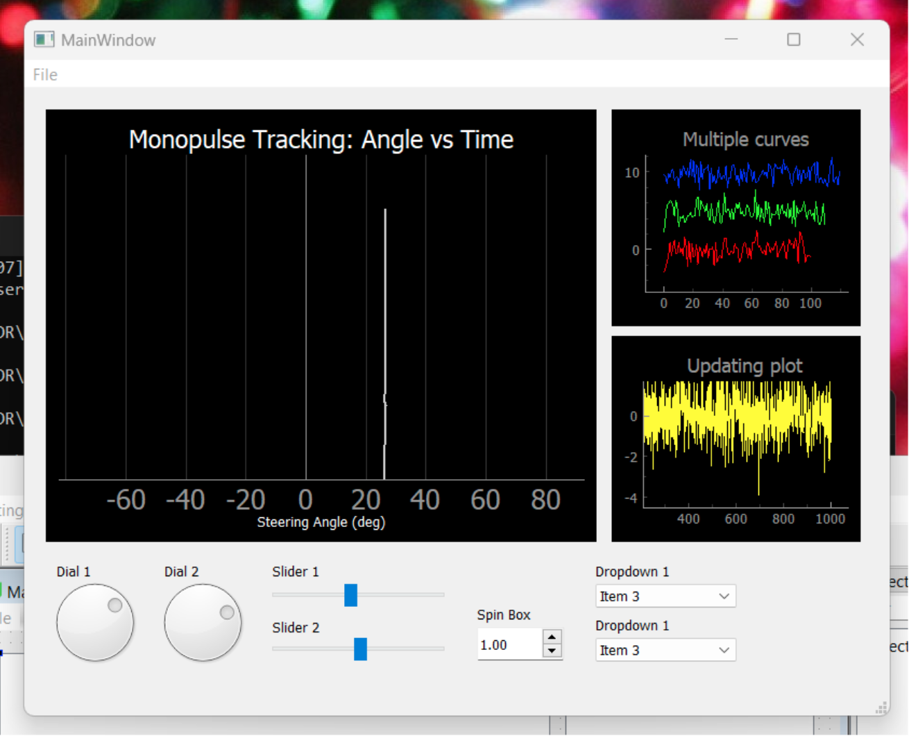
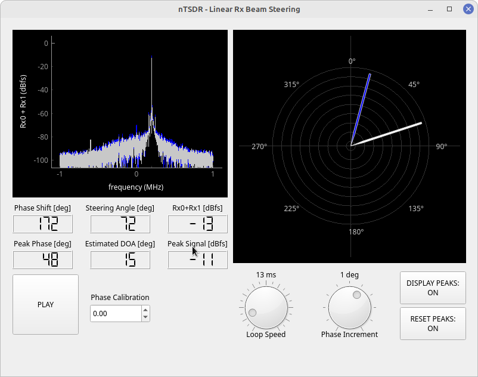

# SDR Beamforming

This is a research project repo for Software Defined Radio Phased Array Beamforming. Previously, we had extensively researched the PlutoSDR to evaluate it for a beamforming project. That was previously the `pluto-sdr` repo, which is now an additional folder inside this repo. Currently, we are researching many different options.

## Project GUI: `PyQT_GUI`

Please visit the [`PyQT_GUI`](https://github.com/RayzrReptile/PyQT_GUI) Project Repo for more information.

<!--   -->
 

<small>Courtesy of&nbsp;<a href="https://github.com/RayzrReptile">@RayzrReptile</a></small>

## Articles Discussing Multi-Transmitter Phase Alignment:

- [How to Generate Multi-Channel Phase-Stable and Phase-Coherent Signals](https://www.keysight.com/blogs/en/tech/rfmw/2019/04/10/how-to-generate-multi-channel-phase-stable-and-phase-coherent-signals)
- [How to Perform Multi-Channel Timing and Phase Alignment](https://www.keysight.com/blogs/en/tech/rfmw/2019/04/18/how-to-perform-multi-channel-timing-and-phase-alignment)
- [Phase Alignment Among Multiple Transmitters](https://www.freepatentsonline.com/y2016/0308598.html)
- [ADI CNO566 Phased Array (Phaser) Development Platform](https://www.analog.com/en/resources/reference-designs/circuits-from-the-lab/cn0566.html)
- [ADI Phased Arrays](https://www.analog.com/en/applications/markets/aerospace-and-defense-pavilion-home/phased-array-solution.html)

## Notable Repos for This Project:

- Jon Kraft's [`Pluto_Beamformer`](https://github.com/jonkraft/Pluto_Beamformer) Repo for PlutoSDR.
- Jon Kraft's [`PlutoSDR_Labs`](https://github.com/jonkraft/PlutoSDR_Labs) Repo for PlutoSDR.
- Jon Kraft's [`PhasedArray`](https://github.com/jonkraft/PhasedArray) Repo for the Analog Devices [ADAR-1000](https://www.analog.com/media/en/technical-documentation/data-sheets/adar1000.pdf). 
   - These appear NLA &amp; the SW repo needs updating to use Multiple PlutoSDRs instead of the ADAR-1000.
   - Option 1: The $2,800 [ADI CNO66](https://www.mouser.com/ProductDetail/Analog-Devices/EVAL-CN0566-RPIZ?qs=9vOqFld9vZV8E7zpQ8NrWw%3D%3D)
   - Option 2: The $21,000 [USRP N310 ZYNQ-7100, 4 CHANNELS](https://www.digikey.com/en/products/detail/ni/785067-01/16818609)
- KrakenRF's [`krakensdr_doa`](https://github.com/krakenrf/krakensdr_doa) Repo for Direction Finding 
on hardware w/ the RPi 4/5 (or on x64 hardware using VirtualBox 7.0+).
- mfkiwl's [`kraken_pr`](https://github.com/mfkiwl/krakensdr_pr) Repo for Passive Radar.
- osmocom's [`rtl-sdr`](https://github.com/osmocom/rtl-sdr) Repo for The Osmocom RTL-SDR.
- ptrkrysik's [`multi-rtl`](https://github.com/ptrkrysik/multi-rtl) Repo for Synchronizing RTL-SDRs.
- ptrkrysik's [`gr-gsm`](https://github.com/ptrkrysik/gr-gsm/tags) Repo for GSM signals on RTL-SDRs.
- analogdevicesinc's [`gr-iio`](https://github.com/analogdevicesinc/gr-iio) Repo for IIO (PlutoSDR) Devices.
- gnuradio's [`gnuradio`](https://github.com/gnuradio/gnuradio) Repo for the GNURadio Program.
- coherent-receiver's [`N-Channel Coherent Transceivers`](https://coherent-receiver.com/pluto-sdr) (Conceptual Only).

## KrakenSDR Resources:

- My [Previous KrakenSDR README](./Toolbox/KrakenSDR/README.md) Page.

## PlutoSDR Resources:

- My [Previous PlutoSDR README](./Toolbox/PlutoSDR/README.md) Page.

## GNURadio Resources:

- My [Previous GNURadio README](./Toolbox/GNURadio/README.md) Page.

## RF Theory, Components, and Test Equipment Articles:
### Theory:

- [Spectrum Analysis Basics](https://www.keysight.com/blogs/en/tech/rfmw/2020/05/01/spectrum-analysis-basics-part-1-what-is-a-spectrum-analyzer): 5 part Series.
- [Rohde & Schwarz's `dB or not dB?`](https://www.rohde-schwarz.com/us/applications/db-or-not-db-educational-note_230850-15534.html) downloadable PDF. Also on that same page are download links for dB Calculator mobile apps.
- Mathworks [Quadrature](https://www.mathworks.com/content/dam/mathworks/mathworks-dot-com/moler/quad.pdf) PDF with the mathematical details.
- The [Fourier Transform](https://www.thefouriertransform.com/) Website
- [I/Q Data for Dummies](http://whiteboard.ping.se/SDR/IQ)
- [How to Process I/Q Signals in a Software-Defined RF Receiver](https://www.allaboutcircuits.com/technical-articles/how-to-process-iq-signals-software-defined-rf-receiver-dsp-digital-signal/)
- [SDR For Engineers](https://www.analog.com/en/education/education-library/software-defined-radio-for-engineers.html)
- [Field Expedient SDR Volumes 1-3](https://www.factorialabs.com/fieldxp/)
- [Phased Array Antenna Handbook](http://twanclik.free.fr/electricity/electronic/pdfdone11/Phased.Array.Antenna.Handbook.Artech.House.Publishers.Second.Edition.eBook-kB.pdf)
- [Antenna Theory Analysis and Design](https://cds.cern.ch/record/1416310/files/047166782X_TOC.pdf)
- LibreTexts Engineering PDFs:
    1. [Fundamentals of Microwave and RF Design](https://eng.libretexts.org/Bookshelves/Electrical_Engineering/Electronics/Book%3A_Fundamentals_of_Microwave_and_RF_Design_(Steer))
    2. [Microwave and RF Design I: Radio Systems](https://eng.libretexts.org/Bookshelves/Electrical_Engineering/Electronics/Microwave_and_RF_Design_I_-_Radio_Systems_(Steer))
    3. [Microwave and RF Design II: Transmission Lines](https://eng.libretexts.org/Bookshelves/Electrical_Engineering/Electronics/Microwave_and_RF_Design_II_-_Transmission_Lines_(Steer))
    4. [Microwave and RF Design III: Networks](https://eng.libretexts.org/Bookshelves/Electrical_Engineering/Electronics/Microwave_and_RF_Design_III_-_Networks_(Steer))
    5. [Microwave and RF Design IV: Modules](https://eng.libretexts.org/Bookshelves/Electrical_Engineering/Electronics/Microwave_and_RF_Design_IV%3A_Modules_(Steer))
    6. [Microwave and RF Design V: Amplifiers and Oscillators](https://eng.libretexts.org/Bookshelves/Electrical_Engineering/Electronics/Microwave_and_RF_Design_V%3A_Amplifiers_and_Oscillators_(Steer))
- [Advances in Phased Array Analog Beamforming Solutions](https://ez.analog.com/webinar/c/e/182)
- [What Is Beamforming?](https://www.youtube.com/watch?v=VOGjHxlisyo)
- [What Are Phased Arrays?](https://www.youtube.com/watch?v=9WxWun0E-PM)
- [Why Is Digital Beamforming Useful?](https://www.youtube.com/watch?v=Hb6BhqOgmAI)
- [Software Defined Radio Systems and Analysis Playlist](https://www.youtube.com/playlist?list=PLBfTSoOqoRnOTBTLahXBlxaDUNWdZ3FdS): 26 Lectures

### SDR Online Lessons:
- [Great Scott Gadgets](https://greatscottgadgets.com/sdr/) Tutorials

### Articles: 
- [DIY Radio: Jon Kraft](https://ez.analog.com/tags/DIYRadio)

### Antennas:

- MathWorks Video: [Array Design and Beamforming for Wireless MIMO Systems](https://www.mathworks.com/support/search.html/videos/array-design-and-beamforming-for-wireless-mimo-systems-1639591309094.html?fq%5B%5D=asset_type_name:video&fq%5B%5D=category:comm/index&page=1)
- [Antenna Theory](https://www.antenna-theory.com/) Website
    - [Smith Charts](https://www.antenna-theory.com/tutorial/smith/chart.php)!!!! (My Favorite)

### Test Equipment:

- The ~ $150 TinySA Handheld Spectrum Analyzer: [tinySA Home](https://tinysa.org/wiki/pmwiki.php?n=Main.HomePage)
    - [Wiki Page](https://tinysa.org/wiki/pmwiki.php?n=Main.HomePage) and all the supporting docs for the pocket sized Spectrum Ananlyzer ~ 0.1MHz to 5.3GHz range.

- The ~ $120 NanoVNA: [NanoVNA Home](https://nanovna.com/)
    - [Absolute Beginner's Guide to the NanoVNA](http://www.nemarc.org/Absolute_Beginner_Guide_NanoVNA.pdf) downloadable PDF.
    - The [Unofficial NanoVNA User Guide](https://www.qsl.net/g0ftd/other/nano-vna-original/docs/NanoVNA%20User%20Guide-English-reformat-Oct-2-19.pdf) PDF.
    - [NanoVNA Calibration Routine](https://nanovna.com/?page_id=2)
    - Rigol's [`Basic Measurements with a VNA`](https://www.rigolna.com/pdfs/VNA-Measurements.pdf) downloadable PDF.
    - Video: [NanoVNA H4 Setup & Calibration](https://www.youtube.com/watch?v=rQGTG7GuPtM)
    - Video: [How to properly use a NanoVNA V2 Vector Network Analyzer & Smith Chart](https://www.youtube.com/watch?v=_pjcEKQY_Tk)

- Newer ~ $789.00 5kHz - 6 Ghz handheld VNA Unit: [NanoRFE VNA6000](https://nanorfe.com/vna6000.html) information Page.
    - NanoRFE [Home Page](https://nanorfe.com/nanovna-v2.html).
    - They also have a V2 version that is an older less capable model for $299.00.

- [The RF Engineer's Essential Guide to Frequency Counters](https://www.keysight.com/blogs/en/tech/educ/2023/frequency-counter-essential-guide)

## Other Resources:
### Useful Programs:
#### Linux & Windows:

- [QtTinySA](https://github.com/g4ixt/QtTinySA) Desktop GUI for the TinySA Spectrum Analyzer.

#### Linux:
- [GQRX](https://gqrx.dk/)

#### Windows:
- [AirSpy: SDR Sharp](https://airspy.com/download/) 
    - [Add'l Plugins For SDR Sharp](https://www.rtl-sdr.com/sdrsharp-plugins/)
    - [Frequency Manager](https://www.freqmgrsuite.com/) For SDR Sharp
- [SDR Console](https://www.sdr-radio.com/)
- [HDSDR](http://www.hdsdr.de/)
- [DSD+](https://www.dsdplus.com/) Digital Signal Decoder.
    - Note that v1.101 is free, but the latest version is a paid one-time subscription fee.
    - Also see [This RadioReference Get Started Guide](https://forums.radioreference.com/threads/need-beginners-guide-to-dsd-fastlane.463963/).
- [Unitrunker Digital Decoder](http://www.unitrunker.com/)

## Status:

