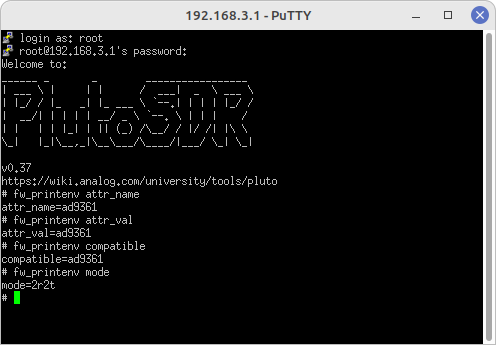
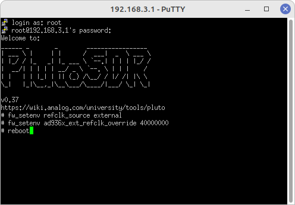

# Pluto SDR

This repo is a compilation of code and resources for the ADALM-PLUTO SDR module for project research of the beamforming concept. The code in the `testCode` folder has been compiled from other sources as working skeleton code for the AD936x Tranceiver for testing purposes.

 

<small>
    <a href="https://www.analog.com/en/design-center/evaluation-hardware-and-software/evaluation-boards-kits/adalm-pluto.html">
        Image Source
    </a>
</small>

## TX / RX Modification Screenshots:

Pluto Settings for TX and RX Modifications:

 

Verify Updated Firmware & Modified Settings. 
Note that `root` password = `analog`

 

## External Clock Source Modification Screenshots:

Please note: 
- The PlutoSDR being modded in this case MUST HAVE A u.FL on the board for an external clock source!! 
- Make sure to check. The early revision PlutoSDRs did not have them.

Pluto Settings to accept an external 40MHz clock source:

 

Again, Verify the changed settings:

 

## Using a PlutoSDR with GNU Radio

If the PlutoSDR in use has the 2 Channel Tx & 2 Channel Rx Modification:
To access all channels use the following blocks:
- `FMComms2/3/4 Sink`
- `FMComms2/3/4 Source`
- See Screenshot from GNU Radio Companion:

 

## Resources:

Enable Dual Receive, Dual Transmit and Expand Tuning Range to 0.7 - 6.0GHz for Rev C and newer Pluto SDR:
 - Video: [Enable Dual TX & Dual RX](https://www.youtube.com/watch?v=ph0Kv4SgSuI)
 - Code: [Jon Kraft: Pluto SDR Labs](https://github.com/jonkraft/PlutoSDR_Labs/tree/master)
 - Settings Table: [Environmental Settings](https://wiki.analog.com/university/tools/pluto/devs/booting)
     - Use [PuTTY](https://www.chiark.greenend.org.uk/~sgtatham/putty/latest.html) for Windows or a Terminal in Linux for shell access.
     - In my case, I connected via the serial COM port with PuTTY in Linux Mint.

Coding Docs:
- [Pluto SDR in Python](https://pysdr.org/content/pluto.html)

Pluto SDR Tools and Overview:
 - [Overview and Introduction](https://wiki.analog.com/university/tools/pluto)
 - [ADALM-Pluto for End Users](https://wiki.analog.com/university/tools/pluto/users)

Pluto SDR Quick Start Drivers & IIO Scope:
 - [Quick Start Resources](https://wiki.analog.com/university/tools/pluto/users/quick_start)
 - [Lib-IIO drivers for IIO Scope](https://github.com/analogdevicesinc/libad9361-iio/releases/tag/v0.3)

Pluto SDR Firmware Updates:
 - [Pluto/M2k Firmware](https://wiki.analog.com/university/tools/pluto/users/firmware)

DIY Phased Array using Pluto SDR:
 - Video: [Build Your Own Phased Array Beamformer](https://www.youtube.com/watch?v=2QXKuEYR4Bw)
 - Video: [Monopulse Tracking with a Low Cost Pluto SDR](https://www.youtube.com/watch?v=XP8OWMDHfOQ)
 - Video: [Implementing Time Delay For a Low Cost Digital Beamformer](https://www.youtube.com/watch?v=gQjnSK0UHGQ)
     - Code: [Jon Kraft: Pluto Beamformer](https://github.com/jonkraft/Pluto_Beamformer)
 - Video: [Phased Array Beamforming: Understanding and Prototyping](https://www.youtube.com/watch?v=0hnWfTvETcU)
     - Code: [Jon Kraft: Phased Array Workshop](https://github.com/jonkraft/PhasedArray)
 - Video: [Jon Kraft: Rapid Phased Array Prototyping](https://www.youtube.com/watch?v=B_icccUpxV0)

PyADI-IIO: Python for ADI Industrial I/O Devices:
 - Web Docs: [AD936x Hardware](https://analogdevicesinc.github.io/pyadi-iio/devices/adi.ad936x.html)
 - Code: [Examples, Test, RF](https://github.com/analogdevicesinc/pyadi-iio/tree/master/examples) Folders.

ADI Kuiper Linux for Raspberry Pi (Debian 10 Buster):
 - [Information and Downloads](https://wiki.analog.com/resources/tools-software/linux-software/kuiper-linux)
 - [Pre-Configured Image](https://download.analog.com/phased-array-lab/raspi.7z)

Basic Raspberry Pi Install From Scratch:
 - [RPi 3B+ Bare Install](https://github.com/jonkraft/Pluto-Install-for-Raspberry-Pi)

Also see the informational documents posted in the [assets-docs](./assets-docs/) folder of this repo.